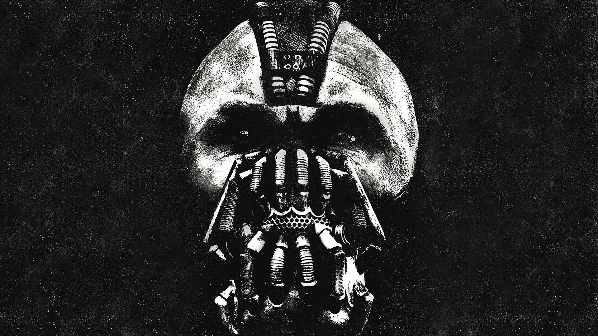
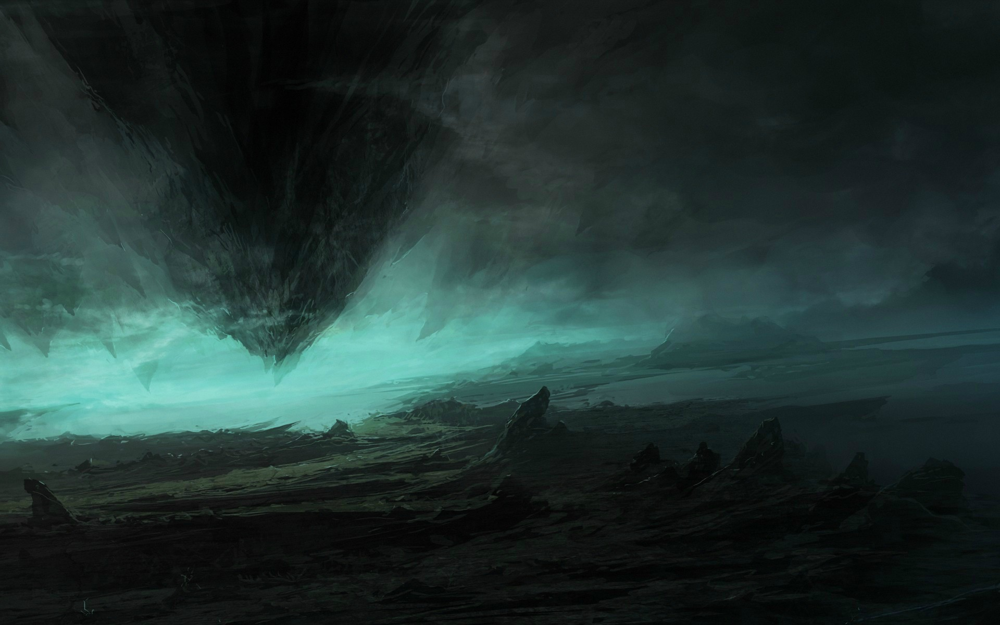
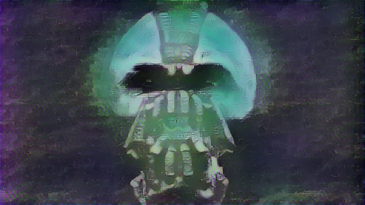

# Neural style transfer
A web app to generate a neural image style transfer image by inputting the style and the content image inside using the web based GUI. To run natively on computer, run `pip install -r requirements.txt` and then run `flask run`.

An example of images produced by the program can be seen below.

Content Image: 
Style Image: 
Generated Image: 
